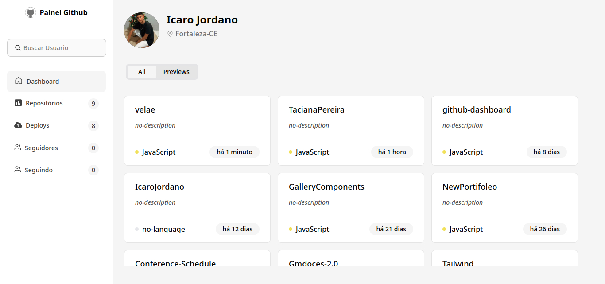

  

# Github-dashboard | Painel Interativo

     <a href="https://icarojordano.github.io/github-dashboard/#/">📱 Visite o Projeto</a>

## 📝 Descrição do Projeto

O GitHub Dashboard é uma aplicação web que permite visualizar e explorar dados de repositórios do GitHub de forma interativa. Com uma interface limpa e responsiva, o dashboard facilita o acompanhamento de métricas e informações relevantes dos projetos hospedados no GitHub.

🔧 Funcionalidades
 - Visualização de informações detalhadas de repositórios públicos do GitHub
 - Interface responsiva e amigável ao usuário
 - Exibição de estatísticas como estrelas, forks e issues
 - Navegação intuitiva entre diferentes repositórios

---

### O que esse projeto resolve

- Dificuldade em visualizar informações de repositórios de forma rápida e amigável.
- Falta de painéis visuais simples para acompanhar repositórios sem acessar diretamente o GitHub.
- Necessidade de uma ferramenta leve e prática para freelancers, equipes ou curiosos monitorarem projetos.
- Facilita a leitura de dados por pessoas menos familiarizadas com a interface nativa do GitHub.

## 💻 Tech Stack

<!--- # "Verify icons availability here https://github.com/tandpfun/skill-icons" -->

  

<h2 id="layout">🎨 Layout</h2>

    

## 🧩 Features

- [x] Busca por usuários do GitHub: insira um nome de usuário e visualize os dados dos repositórios públicos vinculados a ele.
- [X] Listagem de repositórios: exibe os repositórios de forma organizada com nome, descrição e informações relevantes.
- [X] Visualização de métricas: veja dados como número de estrelas, forks, issues abertas e linguagem principal de cada repositório.
- [X] Navegação com React Router: permite transições suaves entre as páginas sem recarregar a aplicação.
- [X] Interface intuitiva e responsiva: design leve, limpo e adaptável para uso em desktop e mobile.
- [X] Integração com a GitHub API: dados em tempo real diretamente da API oficial do GitHub.
- [X] UX pensada para desenvolvedores e recrutadores: ideal para explorar rapidamente o conteúdo de um perfil público no GitHub.

<h2 id="colab">🤝 Collaborators</h2>

Agradecimento especial a todas as pessoas que contribuíram para este projeto.

<table>
  <tr>
    <td align="center">
      <a href="#">
         
        
          <b>Icaro Jordano | Desenvolvedor 
            e Tech Manager</b>
        
      </a>
    </td>
    
  </tr>
</table>
